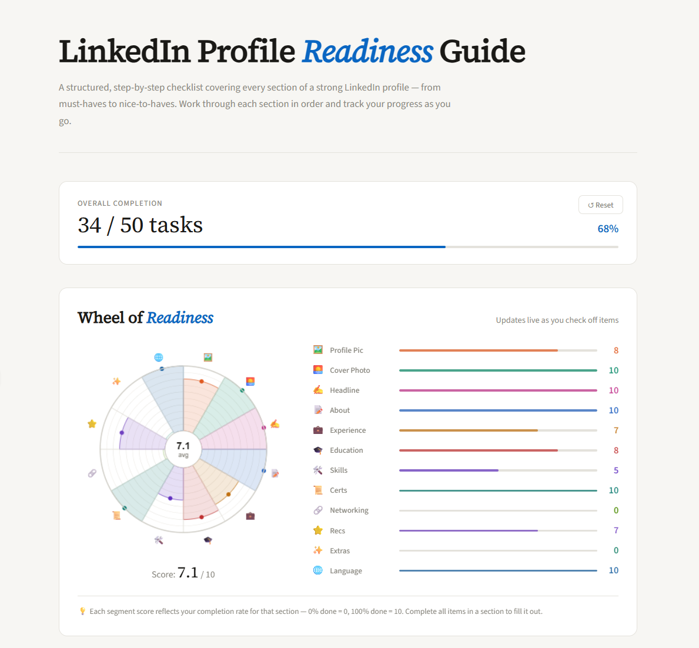
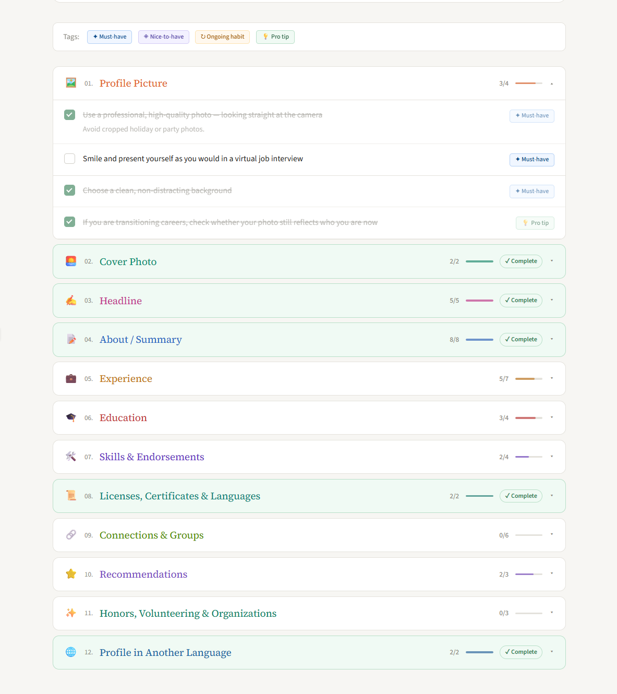

# LinkedIn Profile Readiness Guide

A structured, step-by-step checklist that scores your LinkedIn profile across 12 dimensions — from must-haves to nice-to-haves. Work through each section in order and track your progress as you go.

**[→ Open the tool](https://sebastian-weber.github.io/linkedin-readiness-guide/)**

---



---

## What it does

- Scores your LinkedIn profile across **12 dimensions** (Profile Picture, Cover Photo, Headline, About, Experience, Education, Skills, Certifications, Networking, Recommendations, Extras, Language Profile)
- **Wheel of Readiness** updates live as you check off items — each segment fills based on your completion rate
- Progress persists in your browser via **localStorage** — no login, no data collected
- Tags every item as Must-have, Nice-to-have, Ongoing habit, or Pro tip

---



---

## Built with

- Vanilla JavaScript
- HTML / CSS
- Canvas API (wheel rendering)
- localStorage (state persistence)

No frameworks. No dependencies. Single file.

---

## Background

Built during the [neuefische Data Analytics & AI Bootcamp](https://www.neuefische.de/) (2026), inspired by neuefische's career framework for job market readiness.

Tested by designers and developers within the bootcamp community.

---

## Use it

The tool runs entirely in the browser. No installation needed.

**[→ Open live tool](https://sebastian-weber.github.io/linkedin-readiness-guide/)**

To run locally: clone the repo and open `index.html` in your browser.

```bash
git clone https://github.com/sebastian-weber/linkedin-readiness-guide.git
cd linkedin-readiness-guide
open index.html
```

---

## License

MIT
